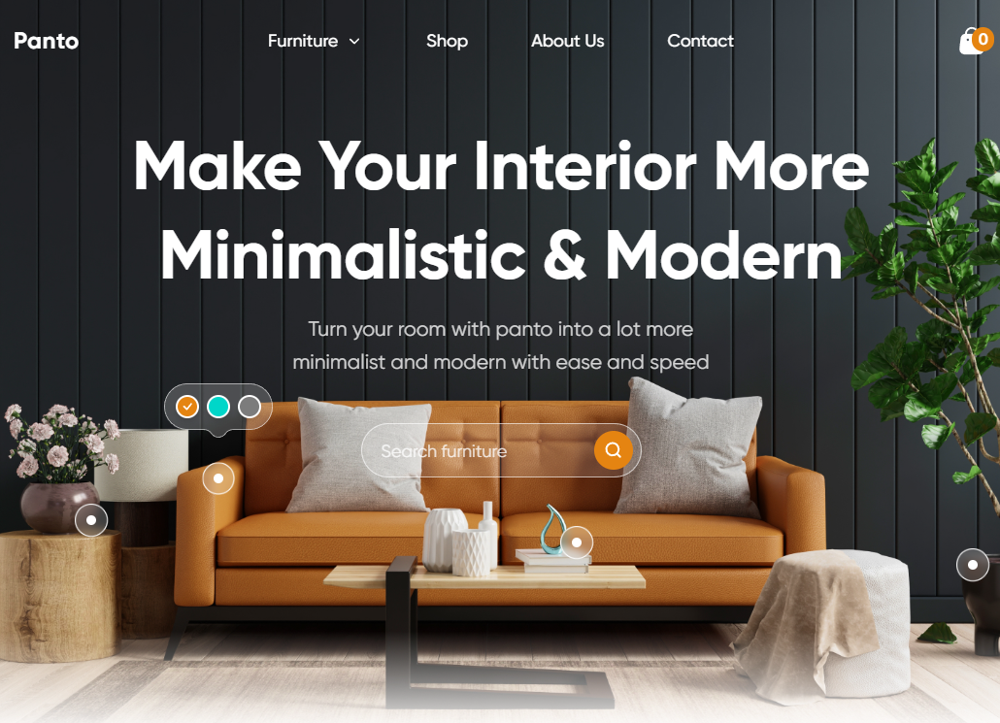

# Panto Furniture Store (webcademy.com)

Данный проект представляет собой одностраничный сайт (лендинг), сделанный по урокам **Юрия Ключевского (ВебКадеми)** - достаточно известного в узких кругах преподавателя по веб-разработке.
**Юрий Ключевский** - один из тех людей, которые показывают на практике, как верстать сайты по макету, объясняя сложные вещи понятным языком. 

<p align="center">
  
  <br/>
  <em>Рисунок 1 - первый блок на странице</em>
</p>

В проекте используются следующие технологии:
1) **Gulp**
2) **SASS** в синтаксисе **SCSS**
3) Нативного **JS** для UI-элементов
4) Популярная библиотека **Swiper** для прокрутки карточек товара

## Как можно посмотреть лендинг
Данный сайт никуда не размещен, поэтому можно посмотреть, склонировав репозиторий и открыв из папки ```_public``` файл ```index.html``` в браузере.

## Информация
Некоторая информация, которую проще по пунктам расписать:
1) Сайт - учебный, одностраничный, прежде всего использовался для обучения верстке
2) Адаптирован под мобильные устройства (с помощью media-запросов и настроек **Swiper**), desktop-first
3) Написан в январе 2024 года
4) Многие пакеты npm устарели, используются те, с которыми работает проект
